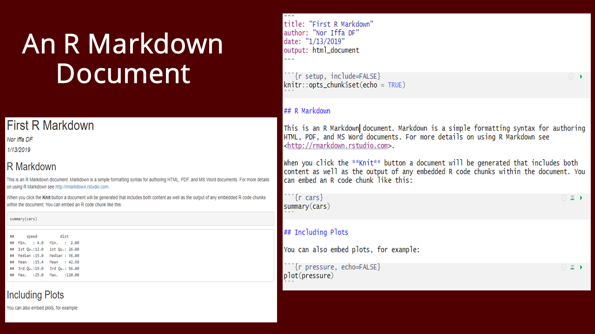
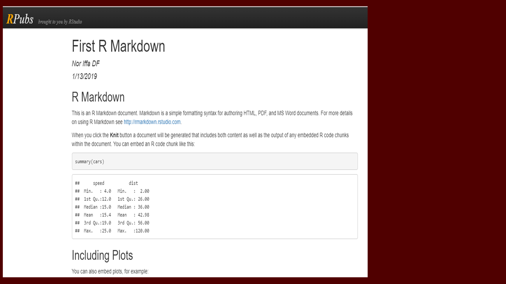

```{r setup, include=FALSE}
options(htmltools.dir.version = FALSE)
knitr::opts_chunk$set(tidy = FALSE, eval = FALSE)
```

class: center, middle, inverse


Image credit: [rmarkdown package](https://bookdown.org/yihui/rmarkdown/)

---
class: inverse

# `rmarkdown`

R has excellent utilities for reporting and communication including `rmarkdown` (a method for integrating code, graphical output, and text into a journal-quality report) and Shiny.

To install the rmarkdown package in R:

```{r}
# Install from CRAN
install.packages('rmarkdown')

# install from GitHub
devtools::install_github('rstudio/rmarkdown')
```


## [RStudio Formats](https://rmarkdown.rstudio.com/formats.html)
- Documents (PDF, HTML, Notebook, Word)
- Presentation (ioslides, reveal.js, Slidy, Powerpoint)
- Journals (JSS, ACM, ACS, ctex, Elvesiers Journal)
- Shiny
- More (flexdashboard, bookdown, blogdown, tufte)

---

class: inverse

# Quick intro `rmarkdown`

- Create a new R markdown from the menu `File -> New File -> R Markdown`



---
class: inverse

# Rpubs 
- If you dont want to publish a whole website
- You can just publish r markdown html output to Rpubs


[Example: http://rpubs.com/niffadf16/first_rmd](http://rpubs.com/niffadf16/first_rmd)




---
class: inverse

# Examples

- Airbnb uses R Markdown to document all their analyses in R, so they can combine code and data visualizations in a single report. [Bion, Chang, and Goodman 2018](https://doi.org/10.1080/00031305.2017.1392362.)

- Writing blog using `blogdown`  Rob J Hyndman’s personal website: https://robjhyndman.com (a very comprehensive academic website)

- This slide.

---

class: center, middle, inverse

# Keep in touch


<a href="mailto:niffadf@gmail.com"><i class="fa fa-paper-plane fa-fw"></i>&nbsp; niffadf@gmail.com</a><br>
<a href="http://github.com/niffadf"><i class="fa fa-github fa-fw"></i>&nbsp; @niffadf</a><br>

---

class: center, middle, inverse

# Thanks!

Slides created via the R package [**xaringan**](https://github.com/yihui/xaringan)
