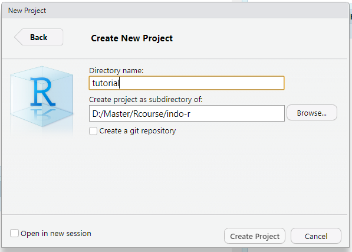
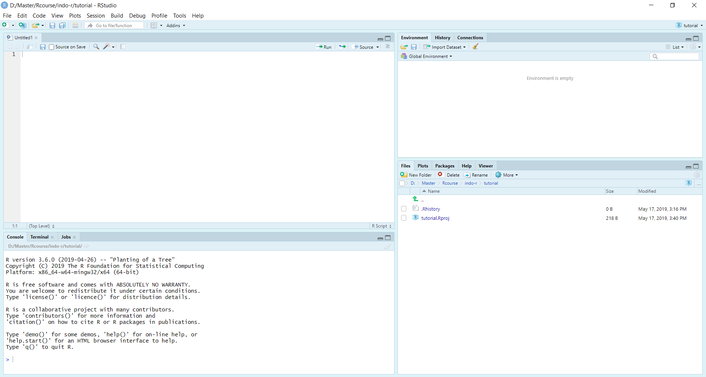

class: title-slide-custom

<div class="my-logo-right"></div> 

```{css, echo=FALSE}
.my-logo-right {
content: "";
    position: absolute;
    top: 15px;
    right:   8px;
    height: 40px;
    width: 120px;
    background-repeat: no-repeat;
    background-size: contain;
    background-image: url(https://mirrors.creativecommons.org/presskit/buttons/88x31/png/by-sa.png);
}

.title-slide-custom .remark-slide-number {
  display: none;
}
```

<br><br><br>
# R untuk Eksplorasi Data Biodiversitas

<br><br> 
## Sabhrina Gita Aninta
### Tambora Muda Indonesia / Komunitas R Indonesia
### 2019/05/16 (updated: `r Sys.Date()`)

---
# Teknis tutorial

Silakan memulai dari membuka project baru dari Rstudio:

> File - New Project... - New Directory - New Project

```{r, out.width="50%", echo=FALSE}

```

Pilih lokasi proyek dan tulis nama folder yang jadi lokasi proyek sesuka Anda, lalu klik `Create Project`.

---

# Teknis tutorial

Sesi baru untuk tempat Anda melakukan proyek akan terbuka, lalu Anda dapat membuka skrip R baru untuk menulis kode R Anda

.pull-left[

]

.pull-right[

]

Jangan lupa menyimpan skrip Anda sebelum memulai menuliskan kode.

Ikuti tutorial dengan mengetikkan kode yang dipresentasikan dalam skrip Anda.

---

class: center, middle, bottom


# Memperoleh Data Biodiversitas

???

Image source: [Clipart Library](http://clipart-library.com/clipart/241546.htm)

---

# Apa itu Data Biodiversitas?

<br><br>
Kata "biodiversitas" dalam bahasa Indonesia baku umum dikenal dalam frase "keanekaragaman hayati" atau disingkat "kehati".

--

Meski tidak baku, kata "biodiversitas" lebih populer di kalangan praktisi dibandingkan "kehati" yang lebih umum digunakan di lingkungan pemerintah.

--

Data biodiversitas ada berbagai macam:

--

- perjumpaan (*occurrence*)

--

- sekuen DNA/RNA/protein

--

- karakter morfologi dan fisiologi

---

# Mengapa data biodiversitas?

<br><br>

.pull-left[
Seluruh hidup kita bergantung kepada biodiversitas:

- air bersih


- udara bersih


- makanan

- tempat tinggal

- kesehatan
]

.pull-right[

]

--

Manajemen biodiversitas yang baik memerlukan manajemen data biodiversitas yang baik.

---

# Pangkalan data (*database*) kehati

<br><br>
Era informasi memungkinkan (dan menuntut) kita memanajemen informasi dengan sistematis dan integratif agar data dapat diakses dan digunakan kembali oleh banyak orang.

--

Berbagai pangkalan data kehati tersebar di dalam jaringan:

--

- Global Biodiversity Information Facility ( [GBIF](https://www.gbif.org) )

--

- Global database of biodiversity time series ( [BioTIME](http://biotime.st-andrews.ac.uk) )

--

- An Anthropocene map of genetic diversity ( [iMapGenes](https://macroecology.ku.dk/resources/imapgenes) )

--

Yang lokal:

--

- [Indonesian Biodiversity Information Facility](http://inabif.lipi.go.id)

--

- [Biodiverskripsi](https://biodiverskripsi.org)

--

- [Atlas Burung Indonesia](http://atlasburung.web.id)

---

# Komponen data kehati

<br><br>
Data kehati memiliki berbagai macam atribut:

--

- ID unik

--

- nama spesies (*binomial nomenclature*, contoh: *Oryza sativa*, *Gecko gecko*, dll.)

--

- lokasi perjumpaan (koordinat, nama daerah, dll.)

--

- waktu perjumpaan (tanggal, jam, tahun, dll.)

--

- kuantitas organisme (jumlah individu, biomassa, OTU, dll.)

--

- data abiotik pendukung (suhu, kondisi tanah, cahaya)

--

- data organisme lain yang berkaitan (biomassa vegetasi, kelimpahan parasit, dll.)


---

# Unduh data dari pangkalan

Beberapa pangkalan menyediakan data yang langsung dapat diunduh dari dalam jaringan setelah pengguna melakukan *log in*.

--

GBIF memiliki API yang dapat digunakan via R.

--

```{r GBIF, eval=FALSE}
library(rgbif)

## mencari data perjumpaan
occ_search(scientificName = "Bubalus", country = "ID", limit = 20)
buffaloID<-occ_search(scientificName = "Bubalus", country = "ID")
summary(buffaloID)
buffaloData<-buffaloID$data

head(buffaloData)
```

---

# Unduh data dari pangkalan

Menggunakan `rgbif::occ_search()` kita hanya akan mendapat maksimal 500 data perjumpaan.

--

Seluruh data hanya dapat diperoleh langsung dari situs GBIF<sup>1</sup> atau `rgbif::occ_download()`<sup>2</sup>.

--

Lebih banyak tentang menggunakan package `rgbif` dapat dilihat di [sini](https://ropensci.github.io/rgbif/index.html).

--

.footnote[

[1] Sudah harus mendaftar di gbif.org, menyediakan username dan password, lalu *log in* sebelum unduh.

[2] Jika ingin menggunakan fungsi ini, kita harus lebih dulu mengatur `Sys.setenv(GBIF_USER="username", GBIF_PWD="password", GBIF_EMAIL="e-mail")` namun saat ini fungsi tersebut sedang bermasalah per 16/05/2019. 

]

---
class: center, middle, inverse

# Tentang eksplorasi data

---

# Apa itu eksplorasi data?

<br><br>
Eksplorasi data adalah siklus iteratif:

1. Membuat pertanyaan terkait data

--

2. Menjawab pertanyaan dengan memvisualisasikan data

--

3. Gunakan hasil eksplorasi untuk mempertajam pertanyaan/membuat pertanyaan baru

---

# Beberapa pertanyaan untuk memulai

<br><br>
1. Variasi macam apa yang ada dalam variabel-variabel data saya?

> Variasi adalah kecenderungan perubahan nilai dalam suatu variabel


2. Kovariasi macam apa yang ada di antara variabel-variabel dalam data saya?

> Kovariasi adalah kecenderungan perubahan nilai dari dua atau lebih variabel

---

# Tentang visualisasi data

Ada banyak package di R untuk memvisualisasikan data sebagai tambahan dari bawaan package "menggambar" di R yaitu `graphics`, contoh: `lattice`, `ggplot2`, dll.

Berikut adalah perbandingan pembuatan plot menggunakan `graphics` dan `ggplot2`.

.pull-left[
```{r, fig.width=4, fig.height=3}
plot(cars$dist, cars$speed)

```
]

.pull-right[
```{r, message=FALSE, fig.width=4, fig.height=3}

library(ggplot2)
ggplot(cars) +
  geom_jitter(aes(x=dist,y=speed))

```
]

--

Untuk materi kopdar ini, kita akan menggunakan ggplot2

---

# Yang istimewa dari ggplot: *grammar*

<br><br>
Sintaks atau struktur kode dalam `ggplot2` sedemikian rupa sehingga sangat mudah untuk membuat grafik yang kompleks.


No.| Elemen     | Fungsi   | Keterangan
-------------|----------|----------------------------------------------
1. | Data       |          | data mentah yang ingin kita visualisasikan
2. | Geometries | `geom_`  | bentuk geometri untuk merepresentasikan data
3. | Aesthetics | `aes()`  | keterangan tentang geometri atau objek statistik semisal gambar, ukuran, warna, dan posisi
4. | Scales     | `scale_` | memetakan data ke dimensi-dimensi *aesthetics*, semisal kisaran data untuk memplot lebar elemen grafik atau faktor yang diberi warna

---

# Yang istimewa dari ggplot: *grammar*

Mari kita simak contoh yang tadi, dengan tambahan grafik:

```{r, message=FALSE, fig.height=4}
ggplot(cars) +
  geom_jitter(aes(x=dist,y=speed)) +
  geom_histogram(aes(x=dist))
```

---

# Data yang akan kita gunakan

Dalam eksplorasi data kali ini, kita akan menggunakan data yang sudah saya siapkan: 

1. Data kualitatif berupa data perjumpaan kelelawar Sulawesi dari [GBIF](https://www.gbif.org).

```{r ambilData}
lawar<-read.csv("input/bat.csv")
```

2. Data kuantitatif berupa jumlah dan kelimpahan kelelawar tropis dari [BioTIME](http://biotime.st-andrews.ac.uk)

```{r}
mamtrop<-read.csv("input/biotime_rawdata.csv")
mamtrop_met<-read.csv("input/biotime_metadata.csv")
```

---

# Mengapa kelelawar?

<br><br>
Kelelawar memiliki banyak manfaat dalam ekosistem:

.pull-left[

Membantu penyerbukan beberapa tumbuhan komoditas

Kotorannya menjadi sumber nitrogen tumbuhan

Pemakan serangga dan menjadi pembasmi hama alami dalam industri perkebunan

]

.pull-right[


]

???

Image Source: (Merlin Tuttle)[https://www.merlintuttle.org/2015/05/03/loss-of-nectar-bats-threatens-durian-farmers/]

---
class: inverse, middle, center

# Eksplorasi data perjumpaan GBIF
### Berapa jumlah spesies per tahun?

---

# Cek bentuk data

Langkah pertama dalam eksplorasi data adalah memahami struktur data: ada kolom apa saja? apa kelas datanya?

Hal ini dapat dilakukan dengan mudah melalui package `dplyr`.

```{r dataCleaning, message=FALSE}
library(dplyr)
glimpse(lawar)
```

---

# Berkutat dengan dplyr

Package `dplyr` adalah kelompok package `tidyverse` yang menggunakan operator pipa ` %>% ` untuk meneruskan fungsi.

Bandingkan kedua kode ini dan luarannya.

.pull-left[
```{r}
lawar %>% 
  select(speciesname) %>% 
  head()
```
]

.pull-right[
```{r}
head(select(lawar, speciesname))
```
]

---

# Eksplorasi data: distribusi perjumpaan berdasarkan tahun

Mari kita coba membuat plot untuk memvisualisasikan jumlah perjumpaan kelelawar berdasarkan tahun.

--

```{r yearExploration, message=FALSE, fig.height=4}
library(ggplot2)
ggplot(lawar) +
  geom_bar(aes(x=year),na.rm = T) +
  labs(x="tahun",y="jumlah perjumpaan")
  
```

--

Tampak bahwa ada beberapa nilai yang sangat kecil pada tahun sebelum 1970an.

---

# Eksplorasi data: distribusi perjumpaan berdasarkan tahun

Kita bisa melihat apakah ada data di area tersebut dengan mendefinisikan sumbu y dari 0 hingga 20.

```{r, fig.height=3}
ggplot(data=lawar) +
  geom_bar(aes(x=year), na.rm = T)+
  coord_cartesian(ylim=c(0,50)) + #<< kode untuk mengatur sumbu y
  labs(x="tahun",y="jumlah perjumpaan")
```

Apa observasi penting dari data ini?

---

# Eksplorasi data: distribusi perjumpaan berdasarkan tahun

Tampak bahwa data perjumpaan memang bias pada tahun 1970an. Spesimen tidak merata ada di setiap tahun.

Tahun bisa diubah menjadi faktor yang bersifat kategori alih-alih angka kuantitatif.

```{r cars, fig.height=3}
ggplot(data=lawar) +
  geom_bar(aes(x=as.factor(year), #<< kode untuk memfaktorkan tahun
               fill=family), na.rm = T) + ## pakai family karena spesies terlalu banyak
  labs(x="tahun",y="jumlah perjumpaan") +
  theme(axis.text.x = element_text(angle=45))
```

---

# Eksplorasi data: distribusi perjumpaan berdasarkan tahun

Penampilan data tahun yang demikian akan menimbulkan persepsi distribusi kekayaan spesies yang berubah seiring waktu padahal ada bias pencuplikan.

Kita ambil saja interval tahun yang kontinu, yakni dari tahun 1972 sampai dengan 1976.

```{r, fig.height=4}
lawar %>% filter(1972<=year & year <=1976) %>% 
  ggplot() +  
  geom_bar(aes(x=year), na.rm=T) +
  labs(x="tahun",y="jumlah perjumpaan")
```

---

# Eksplorasi data: distribusi perjumpaan berdasarkan tahun

Lalu kita bisa menampilkan jumlah spesies per tahun

```{r, fig.height=4}
lawar %>% filter(1972<=year & year <=1976) %>% 
  group_by(year) %>% 
  count(speciesname) %>% 
  ggplot() +  
  geom_bar(aes(x=year), na.rm=T)
```

--

Apakah sudah tepat menyimpulkan tren perubahan jumlah spesies dari data ini?

---
class: inverse, center, middle

# Eksplorasi data kelimpahan dari BioTIME
### Bagaimana tren kelimpahan spesies di ekosistem tropis?

---

# Apa yang harus kita lakukan?

<br><br>
--

Cek data apakah sudah terbaca dengan benar

--

Cek tipe variabel yang ada dalam data

--

Visualisasikan data yang ingin kita eksplor


---

# Mari kita lihat ada variabel apa saja

<br><br>
Apa saja fungsi yang dapat kita gunakan?

--

```{r}
glimpse(mamtrop)
```

---

# Mari kita lihat ada variabel apa saja

```{r}
glimpse(mamtrop_met)
```

---

# Melihat variasi data

<br><br>
```{r, fig.height=4}
ggplot(mamtrop) +
  geom_histogram(aes(ABUNDANCE), binwidth = 10)
```


---

# Melihat kovariasi data

<br><br>
```{r, fig.height=4}
ggplot(mamtrop) +
  geom_jitter(aes(x=ABUNDANCE,y=BIOMASS))
```

---

# Bagaimana cara melihat tren kelimpahan?

<br><br>
--

sumbu x adalah waktu

--

sumbu y adalah kelimpahan

--

```{r, fig.height=4}
ggplot(mamtrop) +
  geom_jitter(aes(x=YEAR,y=ABUNDANCE))
  
``` 

---
class: center, middle

# Apalagi yang dapat dieksplor?

### Salurkan kode Anda dalam kopdar!

---
class: inverse, center, middle

# Terima kasih!

Slides created via the R package [**xaringan**](https://github.com/yihui/xaringan).

The chakra comes from [remark.js](https://remarkjs.com), [**knitr**](http://yihui.name/knitr), and [R Markdown](https://rmarkdown.rstudio.com).
